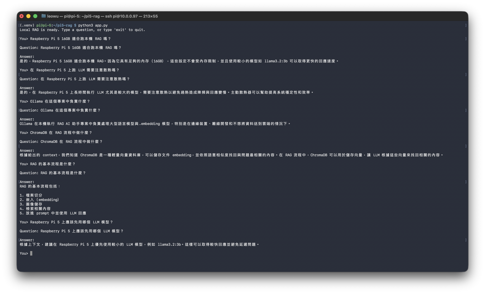

# raspberry-pi-5-local-rag

Small local RAG AI application for Raspberry Pi 5 16GB using Ollama and ChromaDB.

This project provides two entry points:

- CLI: `app.py`
- Web GUI: `app_gradio.py` using Gradio
- Both versions share the same `LocalRAG` pipeline, ChromaDB storage, Ollama models, and streaming answer support.

## What This Does

This project demonstrates a lightweight local Retrieval-Augmented Generation workflow:

1. Load a small built-in Raspberry Pi / local AI knowledge base.
2. Generate embeddings locally with Ollama.
3. Store and query vectors with ChromaDB.
4. Send the retrieved context to a local Ollama LLM.
5. Answer questions from the terminal or a local web UI.
6. Stream generated answers while the local model is thinking.

The default setup is intentionally small enough for a Raspberry Pi 5 16GB.

## Applications

This repo produces two runnable applications.

The CLI version is best for SSH sessions, quick tests, scripts, and low-overhead usage on Raspberry Pi:

```sh
python3 app.py
```

The Gradio Web GUI is best for browser-based demos on the Pi or another device in the same local network:

```sh
python3 app_gradio.py
```

## Requirements

- Raspberry Pi 5 16GB or another local machine
- Python 3.10+
- Ollama installed and running
- Enough disk space for the selected Ollama models

Python dependencies are listed in `requirements.txt`:

```txt
chromadb
ollama
gradio
```

## Setup

Create a virtual environment and install dependencies:

```sh
python3 -m venv .venv
source .venv/bin/activate
pip install -r requirements.txt
```

Install Ollama from [ollama.com](https://ollama.com), then pull the default models:

```sh
ollama pull nomic-embed-text
ollama pull llama3.2:3b
```

Make sure Ollama is running:

```sh
ollama serve
```

If Ollama is already running as a service, you do not need to start it again.

## Usage

### CLI

Start interactive chat mode:

```sh
python3 app.py
```

Ask a single question:

```sh
python3 app.py --question "Raspberry Pi 5 的處理器是什麼？"
```

Sample questions:

```sh
python3 app.py --question "Raspberry Pi 5 16GB 適合跑本機 RAG 嗎？"
python3 app.py --question "在 Raspberry Pi 5 上跑 LLM 需要注意散熱嗎？"
python3 app.py --question "Ollama 在這個專案中負責什麼？"
python3 app.py --question "ChromaDB 在 RAG 流程中做什麼？"
python3 app.py --question "RAG 的基本流程是什麼？"
python3 app.py --question "Raspberry Pi 5 上應該先用哪個 LLM 模型？"
```

Show retrieved source snippets:

```sh
python3 app.py --question "本機 RAG 需要注意什麼？" --show-sources
```

Stream the answer while Ollama is generating:

```sh
python3 app.py --question "RAG 的基本流程是什麼？" --stream
```

You can also use streaming in interactive mode:

```sh
python3 app.py --stream
```

Rebuild the ChromaDB index:

```sh
python3 app.py --rebuild
```

Use another local generation model:

```sh
python3 app.py --model llama3.1:8b
```

`llama3.2:3b` is the conservative default for Raspberry Pi 5. Larger models may work on a 16GB device, but responses can be slower.

### Web GUI With Gradio

Start the Gradio web interface:

```sh
python3 app_gradio.py
```

Open the displayed local URL in a browser. On a Raspberry Pi in the same network, use:

```text
http://<raspberry-pi-ip>:7860
```

Common options:

```sh
python3 app_gradio.py --host 0.0.0.0 --port 7860
python3 app_gradio.py --rebuild
python3 app_gradio.py --model llama3.2:3b --top-k 3
```

The Web GUI uses the same RAG pipeline and ChromaDB storage as the CLI version.
After clicking **Ask**, the page shows a loading message while ChromaDB retrieves context, then streams the answer while Ollama is generating.
The Gradio app uses generator-based streaming. If you need a standard SSE API endpoint later, add a small FastAPI service around the same `LocalRAG.stream_answer()` method.

### Streaming Behavior

Streaming is supported in both apps:

- CLI uses `--stream` and prints tokens to stdout as Ollama generates them.
- Gradio uses generator-based streaming with `demo.queue()` so the Answer panel updates progressively.
- Both paths use `LocalRAG.stream_answer()` from `app.py`.

## Running Sample

Interactive RAG session running locally with Ollama and ChromaDB:



## Data Storage

ChromaDB stores the local vector database in:

```text
./chroma_db
```

Delete this folder or run `python3 app.py --rebuild` to recreate the index from the built-in knowledge base.

## Configuration

Useful command options:

```sh
python3 app.py --help
python3 app_gradio.py --help
```

Main options:

- `--question`: ask one question and exit.
- `--model`: set Ollama generation model. Default: `llama3.2:3b`.
- `--embed-model`: set Ollama embedding model. Default: `nomic-embed-text`.
- `--db-path`: set ChromaDB storage path. Default: `./chroma_db`.
- `--top-k`: number of retrieved chunks. Default: `3`.
- `--rebuild`: recreate the ChromaDB collection before asking.
- `--show-sources`: print retrieved context snippets.
- `--stream`: stream generated tokens to stdout.

Web GUI options include:

- `--host`: Gradio server host. Default: `0.0.0.0`.
- `--port`: Gradio server port. Default: `7860`.
- `--rebuild`: rebuild the ChromaDB collection when the Gradio app starts.
- `--share`: create a public Gradio share link.

## Troubleshooting

If you see an Ollama connection error, check that Ollama is installed and running:

```sh
ollama list
```

If a model is missing, pull it:

```sh
ollama pull nomic-embed-text
ollama pull llama3.2:3b
```

If ChromaDB has stale data, rebuild the index:

```sh
python3 app.py --rebuild
python3 app_gradio.py --rebuild
```

## Project Status

This is a small local-first RAG starter with one CLI app and one Gradio Web GUI. It supports loading status and streaming answers, but it is not yet a document upload service, standard SSE API server, or production retrieval pipeline.